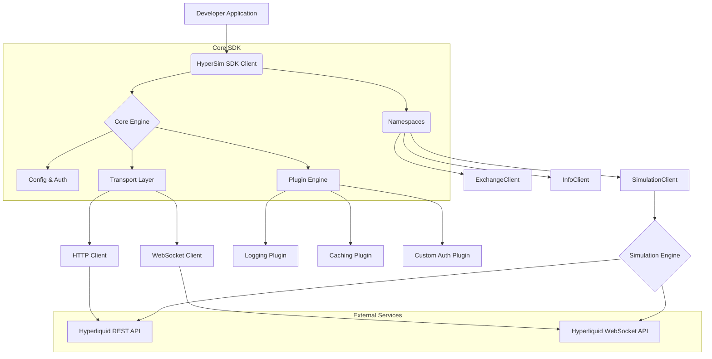

# HyperSim SDK Architecture Specification

## 1. Executive Summary

This document outlines the comprehensive technical architecture for the HyperSim SDK, a next-generation, multi-language Software Development Kit designed to provide unparalleled access to the Hyperliquid protocol. The HyperSim SDK is engineered to deliver a hackathon-winning competitive advantage by addressing critical gaps in the existing ecosystem, primarily in transaction simulation, mobile-native development, and overall developer experience.

Our architecture is founded on three core pillars:
1.  **Stainless-Style Code Generation**: Leveraging a specification-first approach using a forthcoming OpenAPI definition, we will generate type-safe, idiomatic SDKs for TypeScript, Python, Rust, Go, and Swift. This ensures cross-language consistency, reduces maintenance overhead, and incorporates modern SDK best practices from the outset.
2.  **Streaming-First & Plugin-Based Design**: The SDK is architected around a WebSocket-first model for real-time data handling, incorporating patterns from industry leaders like Discord and Stripe. A robust plugin and middleware system, inspired by Figma and modern web frameworks, will provide extensive customizability for features like authentication, caching, and logging.
3.  **L1-Native Transaction Simulation**: Our most significant innovation is a powerful, L1-native transaction simulation engine. This feature will provide developers with pre-execution insights into transaction outcomes, state changes, order book impact, and gas estimation, a capability entirely absent from the current Hyperliquid SDK landscape.

By integrating directly with HyperEVM's unique features—such as its dual-block architecture, precompiled contracts, and native WebSocket streams—the HyperSim SDK will offer a functionally superior, more resilient, and vastly more developer-friendly toolset. This specification serves as the definitive technical blueprint for building a world-class SDK that not only meets but exceeds the demands of modern DeFi developers, positioning our team to win the upcoming hackathon and establish a new standard for the Hyperliquid ecosystem.

## 2. Technical Architecture Overview

The HyperSim SDK is designed as a modular, extensible, and high-performance system that abstracts the complexities of the Hyperliquid protocol while exposing its full power. The architecture is composed of a core client, specialized sub-clients, a streaming interface, a plugin system, and a powerful simulation engine. This layered design promotes separation of concerns and allows developers to use only the components they need, optimizing for bundle size and performance.

### 2.1 Core Components

*   **Core SDK Client**: The central entry point for the SDK. It manages configuration (API keys, timeouts, retries), and provides access to the various sub-clients. It will be initialized using a builder pattern for maximum flexibility.
*   **Sub-Clients (Namespaces)**: The SDK will be organized into logical namespaces, each handling a specific domain of the Hyperliquid API (e.g., `exchange`, `info`, `simulation`). This aligns with the Stainless-style architecture and improves developer ergonomics.
*   **Transport Layer**: An internal component responsible for handling HTTP and WebSocket communication. It will manage connection pooling, request signing, and response parsing, abstracting the underlying communication protocol from the developer.
*   **Streaming Interface**: A dedicated interface for real-time data, built on a resilient WebSocket-first design. It will handle subscriptions, multiplexing, and automatic reconnections with exponential backoff and jitter, based on patterns from AWS and Discord.
*   **Plugin & Middleware Engine**: A powerful system allowing developers to hook into the request/response lifecycle. This will be used for cross-cutting concerns like custom authentication, logging, and caching.
*   **Simulation Engine**: A key differentiator, this engine will provide L1-native transaction simulation, allowing for pre-execution analysis of transaction outcomes.

### 2.2 Architectural Diagram



## 3. HyperEVM Integration Strategy

Our HyperEVM integration strategy is designed to provide seamless and efficient interaction with both the HyperEVM and HyperCore layers, abstracting the complexities of the dual-block architecture and precompile system. The SDK will provide high-level, intuitive APIs for all cross-layer operations.

### 3.1 Dual-Block Architecture Awareness

The SDK will intelligently handle HyperEVM's dual-block architecture (1s small blocks, 1m large blocks). The transport layer will:

*   **Automated Gas-Based Routing**: Automatically route transactions to the appropriate mempool based on their estimated gas usage. Transactions with gas estimates below the 2M threshold will be directed for inclusion in small blocks, while larger transactions will be routed for large blocks.
*   **Developer Overrides**: Provide an option for developers to manually specify the target block type (`'small'` or `'large'`) for fine-grained control over transaction latency and cost.
*   **Nonce Management**: The SDK will manage nonces carefully, respecting the on-chain mempool's limit of 8 pending nonces per address, and will provide utilities for tracking and managing nonce sequences.

### 3.2 Precompile Contract Interaction

The SDK will provide a high-level abstraction layer for all HyperCore precompiled contracts, removing the need for developers to perform low-level `staticcall` operations.

*   **Read Precompiles (`0x00...0800` range)**: The `info` client will feature methods that directly map to the read precompiles. For example, `sdk.info.getPerpPosition(user, perp)` will handle the `staticcall` to the `POSITION_PRECOMPILE_ADDRESS` and parse the returned data into a structured, typed object.
*   **CoreWriter Contract (`0x33...3333`)**: The `exchange` client will provide methods for each L1 action (e.g., `sdk.exchange.transferToL1(...)`). These methods will correctly encode the action type and parameters into the `bytes memory data` payload required by the `CoreWriter.sendRawAction` function.
*   **ERC20 Transfer Contract (`0x22...2222`)**: The SDK will include a dedicated `depositToL1` method that simplifies ERC20 transfers to the designated system contract, ensuring that funds are correctly credited to the user's L1 spot balance.

### 3.3 Handling Cross-Layer Asynchronicity

The SDK will manage the partial atomicity and state visibility delays inherent in the HyperEVM-HyperCore integration:

*   **State Propagation**: For actions that modify L1 state, the SDK will provide polling mechanisms or WebSocket-based listeners to notify the developer when the state change is reflected on HyperCore. For example, after an L1 transfer, the SDK can wait for the corresponding `Received` event on L1.
*   **Error Handling**: The SDK will implement robust error handling for failed L1 actions. Since L1 failures do not revert the EVM transaction, the SDK will monitor for L1-side error events and surface them to the developer as a specific `L1ActionError` type, distinct from EVM transaction failures.
*   **Account Management**: The SDK will include a utility function to check for the existence of an L1 account for a given EVM address and will provide clear error messages and guidance if an L1 account is required for an action but does not exist.

### 3.4 WebSocket and RPC Endpoint Management

The SDK will manage the various endpoints for HyperEVM and HyperCore:

*   **RPC Endpoints**: The client will be configured for the appropriate HyperEVM RPC endpoint (Mainnet: `https://rpc.hyperliquid.xyz/evm`, Testnet: `https://rpc.hyperliquid-testnet.xyz/evm`). It will handle interactions with Chain IDs 999 and 998.
*   **WebSocket Endpoint**: The streaming client will connect to the primary WebSocket endpoint (`wss://api.hyperliquid.xyz/ws`) and manage subscriptions for both public data (trades, order books) and user-specific events (fills, liquidations).


## 4. Stainless-Style Code Generation Architecture

We will adopt a Stainless-style, specification-first approach to SDK development. This methodology ensures that our SDKs are robust, consistent across languages, and easy to maintain. The cornerstone of this strategy is the creation of a comprehensive OpenAPI v3 specification for the Hyperliquid API.

### 4.1 OpenAPI Specification as the Source of Truth

Although Hyperliquid does not currently provide an OpenAPI specification, we will create one as a foundational project asset. This specification will be meticulously crafted to describe every endpoint, data model, and authentication mechanism of the Hyperliquid REST API.

*   **Schema Design**: We will define precise JSON schemas for all API resources, using validation attributes (`pattern`, `minLength`, `maxLength`, `format`, etc.) to ensure data integrity, following the best practices outlined in our research.
*   **Pagination**: We will standardize pagination patterns within the OpenAPI spec, likely using a cursor-based approach, to enable automated pagination handling in the generated SDKs.
*   **Polymorphism**: Where applicable, we will use `oneOf` and `anyOf` to model polymorphic responses, ensuring the generated code can handle multiple response types gracefully.

### 4.2 Code Generation Engine

We will utilize a sophisticated code generation engine, such as the open-source OpenAPI Generator, and heavily customize the templates to produce idiomatic, high-quality code that mirrors the output of Stainless.

*   **Custom Templates**: We will develop custom templates for each target language (TypeScript, Python, Rust, Go, Swift) to ensure the generated code adheres to language-specific best practices and conventions (e.g., context managers in Python, builder patterns in Java/Swift, goroutines in Go).
*   **Idiomatic Code**: The templates will be designed to generate code that feels hand-written, with features like proper type hints, async/await patterns, and comprehensive error handling.
*   **Extensibility**: The generation process will be designed to accommodate manual overrides and extensions, allowing us to implement custom logic and features (like the simulation engine) that go beyond the OpenAPI specification.

### 4.3 Automated SDK Lifecycle

*   **Continuous Synchronization**: We will set up CI/CD pipelines to automatically re-generate the SDKs whenever the OpenAPI specification is updated. This ensures that our SDKs are always in sync with the latest API changes.
*   **Automated Testing**: The CI/CD pipeline will also run a matrix of tests for each generated SDK, ensuring that any changes to the templates or the OpenAPI spec do not introduce regressions.
*   **Release Management**: We will use semantic versioning and a coordinated release process to ensure that all language SDKs are released in lockstep, maintaining feature parity across the ecosystem.

### 4.4 Developer Experience Features

The generated SDKs will include a rich set of developer experience features out-of-the-box:

*   **Type Safety**: The SDKs will be fully type-safe, with runtime validation (using libraries like Zod for TypeScript and Pydantic for Python) to prevent incorrect usage.
*   **Automatic Retries**: Intelligent retry logic with exponential backoff and jitter will be built into the HTTP client.
*   **Structured Error Handling**: The SDKs will feature a hierarchy of custom error types (e.g., `APIError`, `AuthenticationError`, `RateLimitError`), making it easy for developers to handle different error scenarios.
*   **Authentication**: The SDK will handle request signing (EIP-712) and API key management automatically.

## 5. Multi-Language SDK Strategy

Our multi-language strategy is designed to deliver a consistent, idiomatic, and high-performance developer experience across our five target languages: TypeScript, Python, Rust, Go, and Swift. While the core functionality will be consistent, each SDK will be tailored to the specific conventions and strengths of its ecosystem.

### 5.1 TypeScript (Core SDK)

*   **Target**: Universal compatibility (Node.js, Deno, Bun, and modern browsers).
*   **Core Patterns**: ES2020+ features, native `fetch` for HTTP requests, and a WebSocket-first streaming implementation. We will use `zod` for runtime validation and type inference, ensuring robust type safety.
*   **Optimization**: The SDK will be designed for tree-shaking to minimize bundle sizes for front-end applications. We will use namespace exports (`export namespace UserAPI { ... }`) to allow developers to import only the parts of the SDK they need.
*   **Async**: The entire SDK will be async-native, using `Promise` and `async/await` for all operations.

### 5.2 Python

*   **Target**: Python 3.8+ with a focus on the `asyncio` ecosystem.
*   **Core Patterns**: The SDK will be built around `asyncio` and `aiohttp` for high-performance, concurrent I/O. We will use Pydantic v2 for data modeling and validation, providing both runtime safety and a great developer experience. The client will be an `async` context manager for easy setup and teardown of resources.
*   **Idiomatic Features**: We will provide both an async client (`AsyncHyperSimSDK`) and a sync client (`HyperSimSDK`) that wraps the async client for users who are not yet on the `asyncio` stack.

### 5.3 Rust

*   **Target**: High-performance applications, algorithmic trading bots, and systems-level integrations.
*   **Core Patterns**: Leveraging the `tokio` runtime for event-driven I/O and `reqwest` for the HTTP client. We will use `serde` for serialization/deserialization and `thiserror` for structured error handling. The SDK will expose `Stream`-based interfaces for all real-time data feeds.
*   **Zero-Cost Abstractions**: The architecture will be designed to leverage Rust's zero-cost abstractions, ensuring minimal runtime overhead. All data structures will be strongly typed, and the API will be designed to be memory-safe and thread-safe.

### 5.4 Go

*   **Target**: Concurrent applications and services that require high reliability.
*   **Core Patterns**: The SDK will be built using idiomatic Go patterns, with a focus on structured concurrency using goroutines and channels. The client will be designed with a `context.Context` object for cancellation and timeouts. We will use worker pools for managing concurrent requests and `errgroup` for coordinated error handling.
*   **Interfaces**: The SDK will be designed around clear, concise interfaces, allowing developers to easily mock parts of the SDK for testing.

### 5.5 Swift

*   **Target**: Native iOS and macOS applications.
*   **Core Patterns**: The SDK will be built using modern Swift concurrency features (`async/await` and `Task`). We will use `Codable` for data serialization and provide a clean, Swifty API that feels native to the Apple ecosystem. The SDK will be distributed via Swift Package Manager (SPM).
*   **Mobile-First Design**: This SDK is a key strategic priority, as there is currently no native Swift SDK for Hyperliquid. It will be designed from the ground up for mobile use cases, with a focus on performance, low battery consumption, and a seamless integration experience for iOS developers.

## 6. Plugin & Streaming Architecture

Our SDK will be built with a streaming-first, extensible architecture, enabling real-time data handling and extensive customization. This design is inspired by best-in-class implementations from companies like Stripe, Discord, and Figma.

### 6.1 Streaming-First Design with WebSockets

The SDK will prioritize WebSocket connections for low-latency, real-time communication with the Hyperliquid API.

*   **Resilient Connection Management**: The WebSocket client will feature automatic reconnection logic with exponential backoff and jitter to handle network interruptions gracefully. It will also include a heartbeat mechanism to keep connections alive and detect stale connections.
*   **Connection Pooling**: To optimize resource usage, the SDK will maintain a pool of WebSocket connections, allowing multiple subscriptions to be multiplexed over a smaller number of connections where possible.
*   **Backpressure Handling**: The streaming client will implement backpressure handling to prevent the application from being overwhelmed by a high volume of incoming messages.
*   **Compression**: We will investigate and potentially implement WebSocket compression (e.g., zstandard, if supported by the server) to reduce bandwidth consumption, following Discord's successful optimization strategy.

### 6.2 Plugin and Middleware System

The SDK will feature a powerful plugin and middleware system that allows developers to hook into the request/response lifecycle.

*   **Middleware Chain**: We will implement a middleware chain pattern, similar to what is used in web frameworks like Express. This will allow developers to easily add functionality for logging, caching, custom authentication, and more.
*   **Hook-Based System**: In addition to middleware, the SDK will expose a hook-based system for finer-grained control over its internal operations. Developers will be able to register callbacks for events like `before-request`, `after-response`, `on-error`, and `on-stream-event`.
*   **Secure by Default**: For plugins that might execute untrusted code (a potential future feature), we will explore sandboxing techniques similar to Figma's use of iframes and Realms shims to ensure the security of the host application.

### 6.3 Event-Driven Architecture

The SDK will be designed around event-driven principles to facilitate real-time data handling.

*   **EventEmitter**: The core client will be an `EventEmitter` (or its equivalent in other languages), allowing developers to subscribe to various events (e.g., `connected`, `disconnected`, `rate-limit`, `error`).
*   **Typed Events**: All events will be strongly typed, ensuring that developers receive predictable and well-structured data in their event listeners.
*   **Real-time Data Subscriptions**: The streaming client will manage subscriptions to real-time data feeds (e.g., trades, order books, user fills) and emit typed events for each incoming message.

## 7. Core TypeScript SDK Specification

This section provides the detailed technical specification for the core TypeScript SDK. As our reference implementation, it will serve as the blueprint for all other language SDKs.

### 7.1 Client Initialization and Configuration

The client will be initialized via a builder pattern for configuration.

```typescript
// Client Configuration Interface
interface HyperSimSDKConfig {
  apiKey?: string; // For authenticated endpoints
  privateKey?: string; // For signing transactions
  baseUrl?: string; // Defaults to Hyperliquid mainnet
  timeout?: number; // Request timeout in ms, default 30000
  maxRetries?: number; // Default 2
  plugins?: Plugin[];
}

// Main SDK Class
class HyperSimSDK {
  readonly exchange: ExchangeClient;
  readonly info: InfoClient;
  readonly simulation: SimulationClient;

  constructor(config: HyperSimSDKConfig) { ... }
}
```

### 7.2 Namespaced Clients

#### 7.2.1 `InfoClient`

Provides access to public market data and HyperCore read precompiles.

```typescript
class InfoClient {
  // Public market data
  async getMarketData(coin: string): Promise<MarketData>;
  async getOrderBook(coin: string): Promise<OrderBook>;
  async getRecentTrades(coin: string): Promise<Trade[]>;
  async getCandle(coin: string, interval: string, startTime: number, endTime: number): Promise<Candle[]>;

  // Precompile reads
  async getPerpPosition(user: string, perp: string): Promise<PerpPosition>;
  async getSpotBalance(user: string, token: string): Promise<SpotBalance>;
  async getOraclePrice(perp: string): Promise<string>;
}
```

#### 7.2.2 `ExchangeClient`

Handles all authenticated actions, including trading and L1 interactions.

```typescript
class ExchangeClient {
  // Trading
  async placeOrder(orderRequest: OrderRequest): Promise<OrderResult>;
  async cancelOrder(orderId: string): Promise<CancelResult>;
  async updateLeverage(leverage: number, coin: string): Promise<LeverageResult>;

  // L1 Interactions (CoreWriter)
  async transferToL1(amount: string, token: string): Promise<L1ActionResult>;
  async withdrawFromL1(amount: string, token: string): Promise<L1ActionResult>;
}
```

#### 7.2.3 `SimulationClient`

Our key innovation, providing transaction simulation capabilities.

```typescript
class SimulationClient {
  async simulateTransaction(tx: UnsignedTransaction): Promise<SimulationResult>;
  async simulateOrder(orderRequest: OrderRequest): Promise<OrderSimulationResult>;
}

interface SimulationResult {
  success: boolean;
  trace: TransactionTrace;
  stateChanges: StateChange[];
  gasUsed: string;
  error?: string;
}

interface OrderSimulationResult {
  success: boolean;
  slippage: string;
  marketImpact: string;
  estimatedFee: string;
  liquidationPrice?: string;
}
```

### 7.3 Streaming Client

The streaming client will use a subscription-based model.

```typescript
class StreamingClient extends EventEmitter {
  subscribeToTrades(coin: string, handler: (trade: Trade) => void): Subscription;
  subscribeToOrderBook(coin:string, handler: (orderBook: OrderBook) => void): Subscription;
  subscribeToUserFills(user: string, handler: (fill: Fill) => void): Subscription;
  
  unsubscribe(subscription: Subscription): void;
}
```

### 7.4 Plugin System

```typescript
interface Plugin {
  name: string;
  install(sdk: HyperSimSDK): void;
}

// Example: Logging plugin
class LoggingPlugin implements Plugin {
  name = 'LoggingPlugin';
  
  install(sdk: HyperSimSDK): void {
    sdk.addHook('before-request', (context) => {
      console.log('Sending request:', context.url);
    });
    sdk.addHook('after-response', (context) => {
      console.log('Received response:', context.response);
    });
  }
}
```

## 8. Cross-Language Consistency Framework

Maintaining a consistent developer experience across five different languages is a primary architectural goal. Our Cross-Language Consistency Framework is built on a set of standards, tools, and processes designed to ensure API parity, predictable behavior, and a unified feel, even while embracing language-specific idioms.

### 8.1 The OpenAPI Specification as the Core Contract

The OpenAPI specification will serve as the canonical definition of the SDK's public API surface for all REST-based interactions. This ensures that:

*   **Method Signatures are Consistent**: The names, parameters, and return types of all API methods will be defined in the OpenAPI spec, and the code generation process will enforce this consistency across all languages.
*   **Data Models are Standardized**: All request and response models will be defined as JSON schemas in the OpenAPI spec. The generated models in each language will be derived from this single source of truth.

### 8.2 Standardized Feature Set

We will maintain a feature checklist to ensure that all core SDK features are implemented in each language. This includes:

*   **Authentication**: All SDKs will support the same set of authentication mechanisms (API key, EIP-712).
*   **Error Handling**: The hierarchy of error types will be replicated in each language, with consistent error codes and messages.
*   **Retries and Timeouts**: The configuration options for retries and timeouts will be available in all SDKs and will behave consistently.
*   **Streaming and Pagination**: The interfaces for streaming and pagination will follow the same design patterns across all languages.

### 8.3 Idiomatic Implementations

While we strive for consistency, we will not sacrifice developer experience. Each SDK will be implemented using the idioms and best practices of its target language.

*   **Naming Conventions**: We will follow the standard naming conventions for each language (e.g., `camelCase` in TypeScript/Swift, `snake_case` in Python/Rust, `PascalCase` in Go for exported symbols).
*   **Asynchronous Programming**: Each SDK will use the native async programming model of its language (e.g., `async/await` in TypeScript/Python/Swift, `tokio` in Rust, goroutines and channels in Go).
*   **Package Management**: Each SDK will be distributed using the standard package manager for its ecosystem (e.g., npm, PyPI, Cargo, Go Modules, SPM).

### 8.4 Cross-Language Test Suite

We will develop a shared test suite that can be used to verify the behavior of each SDK. This suite will consist of a set of integration tests that make real calls to a testnet version of the Hyperliquid API.

*   **Shared Test Cases**: The test cases will be defined in a language-agnostic format (e.g., YAML or JSON), specifying the method to call, the input parameters, and the expected output.
*   **Language-Specific Test Runners**: Each SDK will have a test runner that can parse the shared test cases and execute them against the SDK implementation.
*   **CI/CD Integration**: The cross-language test suite will be run automatically in our CI/CD pipeline for every commit, ensuring that we catch any regressions or inconsistencies early.

## 9. Developer Experience (DX) Strategy

A superior developer experience is a core product goal. Our DX strategy is focused on providing developers with the tools, documentation, and support they need to be successful with the HyperSim SDK. This strategy is informed by our competitive analysis, which revealed significant gaps in the DX of existing Hyperliquid SDKs.

### 9.1 Interactive and Comprehensive Documentation

*   **OpenAPI-Generated Documentation**: We will use a tool like Redoc or Swagger UI to generate beautiful, interactive API documentation from our OpenAPI specification. This will allow developers to explore the API, make test calls, and see real responses directly in their browser.
*   **Language-Specific Docs**: Each SDK will have its own documentation website with language-specific installation instructions, getting-started guides, and detailed examples.
*   **In-Code Documentation**: We will enforce a high standard for in-code documentation (e.g., JSDoc/TSDoc for TypeScript, docstrings for Python), ensuring that our SDK is self-documenting and that developers can get the information they need directly in their IDE.
*   **Cookbook and Tutorials**: We will create a rich set of tutorials and cookbook-style recipes for common use cases, such as building a trading bot, creating a DeFi dashboard, or integrating with a mobile wallet.

### 9.2 Command-Line Interface (CLI)

We will build a powerful CLI that provides a quick and easy way to interact with the Hyperliquid API from the command line.

*   **Core Functionality**: The CLI will provide commands for all major API operations, such as placing orders, checking balances, and retrieving market data.
*   **Scaffolding**: The CLI will include a scaffolding tool that can quickly generate boilerplate code for a new project, including a basic project structure, example usage of the SDK, and a Dockerfile for easy deployment.
*   **Configuration Management**: The CLI will make it easy to manage multiple API keys and configurations for different environments (e.g., testnet, mainnet).

### 9.3 IDE Integration

*   **Type Definitions**: Our focus on type safety will provide an excellent IDE experience out-of-the-box, with features like autocomplete, type checking, and inline documentation.
*   **Language Server Protocol (LSP)**: We will investigate the possibility of creating a dedicated Language Server for the HyperSim SDK. This could provide advanced features like context-aware autocompletion for things like coin names or order types, and real-time validation of SDK usage.

### 9.4 Testing and Debugging

*   **Mock Server**: We will provide a mock server that developers can use for testing their applications without hitting the real Hyperliquid API. This will make testing faster, more reliable, and free of charge.
*   **Debug Mode**: The SDK will have a debug mode that provides verbose logging of all requests and responses, making it easier to troubleshoot issues.
*   **Structured Errors**: Our structured error types will make it easy to debug and handle errors programmatically.

## 10. Competition Submission Strategy

Our submission for the hackathon will be a fully functional, well-documented, and production-ready SDK that showcases a clear and significant advancement over the existing tools in the Hyperliquid ecosystem. Our strategy is to win by delivering on three key themes: innovation, completeness, and developer experience.

### 10.1 Highlighting Innovation: The Simulation Engine

The centerpiece of our submission will be the **L1-native transaction simulation engine**. This is a feature that is entirely absent from the current Hyperliquid SDK landscape, and it addresses a major pain point for developers. We will demonstrate how our simulation engine can:

*   **Prevent errors**: By simulating transactions before they are sent, developers can catch errors and prevent failed transactions.
*   **Predict outcomes**: The simulation engine will provide detailed information about the expected outcome of a transaction, including state changes, gas usage, and order book impact.
*   **Improve user experience**: By providing users with a preview of their transaction, developers can build more transparent and trustworthy applications.

We will create a compelling demo that shows a side-by-side comparison of a transaction with and without simulation, highlighting the value and power of this feature.

### 10.2 Demonstrating Completeness: The Multi-Language SDK Suite

We will submit a suite of SDKs for our five target languages, with a particular focus on our **native Swift SDK**. The Swift SDK addresses a major gap in the market and will be a key differentiator for our project. We will showcase:

*   **Cross-language consistency**: We will demonstrate how our code generation architecture allows us to produce high-quality, idiomatic SDKs for multiple languages with a consistent API.
*   **Mobile-first design**: We will build a simple but elegant iOS application using our Swift SDK to demonstrate its capabilities and the potential for building rich mobile experiences on Hyperliquid.
*   **Broad appeal**: By supporting a wide range of popular languages, we will show that our SDK is designed to be a foundational tool for the entire Hyperliquid developer community.

### 10.3 Winning on Developer Experience

We will go above and beyond to deliver a world-class developer experience.

*   **Interactive Documentation**: Our beautiful, interactive documentation will make it a pleasure to learn and use our SDK.
*   **Powerful CLI**: Our CLI will provide a quick and easy way to get started with the SDK and perform common tasks.
*   **Comprehensive Examples**: We will provide a rich set of examples and tutorials that show how to use the SDK to build real-world applications.
*   **Polished Presentation**: Our submission will be presented in a professional and polished manner, with a clear and compelling narrative that tells the story of our project and its vision for the future of the Hyperliquid ecosystem.

By focusing on these three themes, we are confident that we can create a submission that is not only technically excellent but also captures the imagination of the judges and the broader Hyperliquid community.

## 11. Implementation Roadmap

We will follow a phased implementation plan to ensure that we can deliver a high-quality, feature-complete SDK in a timely manner. The roadmap is divided into three phases, with clear goals and deliverables for each.

### Phase 1: Foundation and Core SDK (Months 0-3)

*   **Goal**: Build the foundational infrastructure and deliver the core TypeScript SDK and the Swift SDK MVP.
*   **Deliverables**:
    *   Comprehensive OpenAPI v3 specification for the Hyperliquid API.
    *   Custom code generation templates for TypeScript and Swift.
    *   Core TypeScript SDK with full feature parity with the official Python SDK.
    *   Native Swift SDK with core trading functionality.
    *   CI/CD pipeline for automated testing and deployment.
    *   Public documentation website with interactive API docs and getting-started guides.

### Phase 2: Simulation Engine and Language Expansion (Months 3-6)

*   **Goal**: Develop the transaction simulation engine and expand our language support to Python and Go.
*   **Deliverables**:
    *   Transaction simulation engine MVP, integrated into the TypeScript and Swift SDKs.
    *   Python SDK with feature parity with the TypeScript SDK.
    *   Go SDK with core functionality.
    *   Advanced streaming features, including connection pooling and multiplexing.
    *   CLI tool with scaffolding and basic API interaction capabilities.
    *   Expanded test suite with integration tests for the simulation engine.

### Phase 3: Advanced Features and Ecosystem Building (Months 6-10)

*   **Goal**: Build out advanced features, add Rust support, and focus on growing the developer ecosystem.
*   **Deliverables**:
    *   Advanced simulation features, including order book modeling and multi-step transaction bundling.
    *   Rust SDK with high-performance trading capabilities.
    *   Plugin system with a set of official plugins for common use cases (e.g., logging, caching).
    *   Expanded documentation with a rich set of tutorials and cookbook recipes.
    *   Community outreach program, including hackathons, workshops, and developer grants.
    *   Investigation into a dedicated Language Server Protocol (LSP) for enhanced IDE support.

## 12. Technical Risk Assessment

This section identifies potential technical risks that could impact the successful delivery of the HyperSim SDK project, along with our proposed mitigation strategies.

### 12.1 Dependency on Unofficial API and Lack of OpenAPI Spec

*   **Risk**: The Hyperliquid API is not officially documented with an OpenAPI specification, and some of the APIs we will be using are unofficial. This could lead to unexpected changes, breaking our SDK.
*   **Mitigation**:
    *   We will develop a comprehensive test suite that runs continuously in our CI/CD pipeline to quickly detect any breaking changes in the API.
    *   We will maintain a close watch on the official Hyperliquid Discord and GitHub repositories for any announcements about API changes.
    *   Our SDK will be designed with a flexible transport layer that can be easily adapted to API changes.

### 12.2 Complexity of the L1-Native Simulation Engine

*   **Risk**: Building an accurate and performant L1-native simulation engine is a complex task. There is a risk that we may not be able to achieve the desired level of accuracy or performance.
*   **Mitigation**:
    *   We will start with a minimal viable product (MVP) for the simulation engine and iterate on it over time.
    *   We will conduct extensive research into existing EVM simulation tools and techniques to learn from their successes and failures.
    *   We will work closely with the Hyperliquid development team (if possible) to get a deeper understanding of the L1 implementation details.

### 12.3 Maintaining Cross-Language Consistency

*   **Risk**: Maintaining feature parity and a consistent developer experience across five different languages is a significant challenge. There is a risk that the SDKs could diverge over time.
*   **Mitigation**:
    *   Our OpenAPI-driven code generation process will be the cornerstone of our consistency strategy.
    *   Our cross-language test suite will be a critical tool for catching any regressions or inconsistencies early.
    *   We will have a dedicated team member responsible for overseeing the cross-language consistency of the SDKs.

### 12.4 Potential for Scalability and Performance Bottlenecks

*   **Risk**: The streaming and simulation features of our SDK could be performance-intensive. There is a risk of scalability and performance bottlenecks, especially in high-volume trading scenarios.
*   **Mitigation**:
    *   We will conduct extensive performance testing and profiling throughout the development process.
    *   We will leverage the native performance features of each target language (e.g., `tokio` in Rust, `asyncio` in Python).
    *   Our architecture will be designed for scalability, with features like connection pooling and backpressure handling.

### 12.5 Security of the Plugin System

*   **Risk**: A plugin system could introduce security vulnerabilities if not designed carefully. There is a risk that a malicious plugin could compromise the host application.
*   **Mitigation**:
    *   For the initial release, the plugin system will only support trusted, first-party plugins.
    *   If we decide to support third-party plugins in the future, we will implement a robust sandboxing mechanism, following the best practices of platforms like Figma.
    *   We will conduct a thorough security audit of the plugin system before releasing it to the public.

## 13. Sources

This report was synthesized from a wide range of technical documentation, blog posts, and industry best practices. The following sources were instrumental in shaping this architectural specification.

### HyperCore and HyperEVM Integration

*   [1] [HyperEVM Architecture Documentation](https://hyperliquid-co.gitbook.io/wiki/architecture/hyperevm) - High Reliability - Comprehensive technical documentation on HyperEVM architecture.
*   [2] [HyperEVM Developer Guide](https://hyperliquid.gitbook.io/hyperliquid-docs/for-developers/hyperevm) - High Reliability - Developer-focused documentation for HyperEVM.
*   [3] [Inside Hyperliquid's Technical Architecture](https://www.blockhead.co/2025/06/05/inside-hyperliquids-technical-architecture/) - High Reliability - In-depth technical analysis of Hyperliquid's architecture.
*   [4] [HyperEVM and Smart Contract Integration](https://www.gate.com/learn/course/l1-deep-dives-hyperliquid-hype/hyper-evm-and-smart-contract-integration) - High Reliability - Technical guide on HyperEVM integration patterns.
*   [5] [Hyperliquid Report: HyperEVM, HIP-3, HyperCore and Integration Patterns](https://blog.redstone.finance/2025/08/21/hyperliquid/) - High Reliability - Comprehensive technical analysis from RedStone Finance.
*   [6] [Dual-Block Architecture Technical Specifications](https://hyperliquid.gitbook.io/hyperliquid-docs/for-developers/hyperevm/dual-block-architecture) - High Reliability - Official technical specifications for the dual-block architecture.
*   [7] [Interacting with HyperCore - CoreWriter and Precompiles](https://hyperliquid.gitbook.io/hyperliquid-docs/for-developers/hyperevm/interacting-with-hypercore) - High Reliability - Detailed information on HyperCore interaction.
*   [8] [Hyperliquid Core Concepts - Precompiles and System Contracts](https://docs.layerzero.network/v2/developers/hyperliquid/hyperliquid-concepts) - High Reliability - Comprehensive guide to Hyperliquid precompiles.
*   [9] [The Definitive Guide to Hyperliquid Precompiles](https://medium.com/@ambitlabs/the-not-so-definitive-guide-to-hyperliquid-precompiles-f0b6025bb4a3) - High Reliability - In-depth technical guide on precompile implementation.

### SDK Generation and Architecture Patterns

*   [10] [Announcing the Stainless SDK generator](https://www.stainless.com/blog/announcing-the-stainless-sdk-generator) - High Reliability - Official announcement of the Stainless SDK generator.
*   [11] [Why Should Developers Care About Stainless API SDK Generation](https://apidog.com/blog/stainless-api/) - High Reliability - Comprehensive overview of Stainless API's SDK generation approach.
*   [12] [Choosing an SDK vendor: Speakeasy vs Fern vs Stainless vs others](https://www.speakeasy.com/blog/choosing-an-sdk-vendor) - High Reliability - Detailed comparison of SDK vendors.
*   [13] [Review of 8 SDK Generators for APIs in 2025](https://nordicapis.com/review-of-8-sdk-generators-for-apis-in-2025/) - High Reliability - Review of 8 SDK generators with a focus on developer experience.
*   [14] [How to Manage Multi-Language Open Source SDKs on GitHub](https://medium.com/@parserdigital/how-to-manage-multi-language-open-source-sdks-on-githug-best-practices-tools-1a401b22544e) - High Reliability - Best practices for managing multi-language SDKs.
*   [15] [SDK Best Practices](https://www.speakeasy.com/blog/sdk-best-practices) - High Reliability - SDK best practices emphasizing type safety, idiomatic design, and enterprise features.
*   [16] [Mastering OpenAPI Types: Best Practices for Data Types and Formats](https://liblab.com/blog/openapi-data-types-and-formats) - High Reliability - Best practices for OpenAPI data types and formats.
*   [17] [Day 88: Multi-Language SDK Libraries](https://sdcourse.substack.com/p/day-88-multi-language-sdk-libraries) - High Reliability - Multi-language SDK design principles.
*   [18] [An adventure in OpenAPI V3 code generation](https://www.mux.com/blog/an-adventure-in-openapi-v3-api-code-generation) - High Reliability - Mux's journey implementing OpenAPI V3 for SDK code generation.
*   [19] [OpenAPI Generator](https://github.com/OpenAPITools/openapi-generator) - High Reliability - Documentation for the OpenAPI Generator.

### Plugin and Streaming Architecture

*   [20] [Timeouts, retries and backoff with jitter](https://aws.amazon.com/builders-library/timeouts-retries-and-backoff-with-jitter/) - High Reliability - Comprehensive strategies for managing failures in distributed systems from AWS.
*   [21] [The Ultimate Guide to Event-Driven Architecture Patterns](https://solace.com/event-driven-architecture-patterns/) - High Reliability - In-depth analysis of event-driven architecture patterns.
*   [22] [WebSocket architecture best practices to design robust realtime systems](https://ably.com/topic/websocket-architecture-best-practices) - High Reliability - Comprehensive WebSocket architecture best practices.
*   [23] [WebSocket Security](https://devcenter.heroku.com/articles/websocket-security) - High Reliability - WebSocket security patterns from Heroku.
*   [24] [Receive Stripe events in your webhook endpoint](https://docs.stripe.com/webhooks) - High Reliability - Stripe's webhook architecture.
*   [25] [OpenAI Model Streaming: Building Responsive LLM Applications](https://medium.com/neural-engineer/openai-model-streaming-building-responsive-llm-applications-38712e582bce) - High Reliability - OpenAI streaming implementation details.
*   [26] [How Discord Reduced Websocket Traffic by 40%](https://discord.com/blog/how-discord-reduced-websocket-traffic-by-40-percent) - High Reliability - Discord's WebSocket traffic optimization strategies.
*   [27] [How to design a plugin-based scalable architecture?](https://levelup.gitconnected.com/how-to-design-a-plugin-based-scalable-architecture-abb0b2481ea8) - High Reliability - Plugin-based scalable architecture design concepts.
*   [28] [Performance design patterns for Amazon S3](https://docs.aws.amazon.com/AmazonS3/latest/userguide/optimizing-performance-design-patterns.html) - High Reliability - Amazon S3 performance design patterns.
*   [29] [Circuit Breaker Pattern](https://learn.microsoft.com/en-us/azure/architecture/patterns/circuit-breaker) - High Reliability - Comprehensive circuit breaker pattern implementation from Microsoft.
*   [30] [How to build a plugin system on the web and also sleep well at night](https://www.figma.com/blog/how-we-built-the-figma-plugin-system/) - High Reliability - Figma's plugin security architecture.
*   [31] [Design patterns for modern web APIs](https://blog.feathersjs.com/design-patterns-for-modern-web-apis-1f046635215) - High Reliability - Modern web API design patterns.
*   [32] [May 2025 in Auth0: Async Auth, Real-Time Streams, and Custom Everything](https://dev.to/auth0/may-2025-in-auth0-async-auth-real-time-streams-and-custom-everything-2n60) - High Reliability - Auth0's real-time streaming capabilities.
*   [33] [Twilio Streams + NodeJS + Websockets + Redis](https://medium.com/@paulotaylor/twilio-streams-nodejs-websockets-redis-f3ca2f35a864) - High Reliability - Twilio real-time media streaming architecture.
